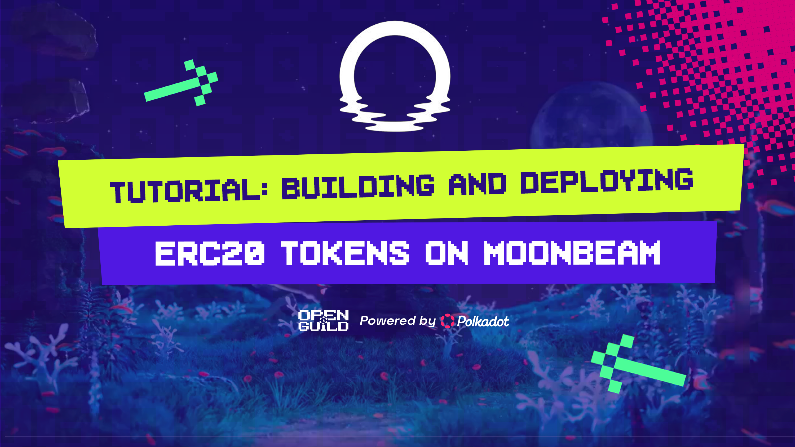

# 📚 Tutorial: Building and Deploying ERC20 Tokens on Moonbeam

## 📝 Prerequisites

Before we start, ensure you have the following:

1. **🌐 Node.js and npm**: Install Node.js (which includes npm) from the [official website](https://nodejs.org/).
   - Verify installation:
     ```bash
     node --version
     npm --version
     ```

2. **🦊 MetaMask**: Install the [MetaMask browser extension](https://metamask.io/download.html) for interacting with the Moonbeam network.

3. **💻 Visual Studio Code (VS Code)**: Set up VS Code for Solidity development.
   - Download and install VS Code from the [official website](https://code.visualstudio.com/).
   - Install the following extensions in VS Code:
     - **Solidity** by Juan Blanco
     - **Hardhat for Visual Studio Code** by Nomic Foundation

### 📦 Setup on Different Operating Systems

#### Windows:
1. Install Node.js:
   - Download the Windows Installer from the [Node.js website](https://nodejs.org/).
   - Run the installer and follow the prompts.
   - Restart your computer to ensure PATH is updated.

2. Install Git:
   - Download Git from [git-scm.com](https://git-scm.com/download/win).
   - Run the installer, using default settings.

3. Install Visual Studio Code:
   - Download VS Code from the [official website](https://code.visualstudio.com/).
   - Run the installer and follow the prompts.

#### macOS:
1. Install Homebrew:
   ```bash
   /bin/bash -c "$(curl -fsSL https://raw.githubusercontent.com/Homebrew/install/HEAD/install.sh)"
   ```

2. Install Node.js:
   ```bash
   brew install node
   ```

3. Install Git:
   ```bash
   brew install git
   ```

4. Install Visual Studio Code:
   - Download VS Code from the [official website](https://code.visualstudio.com/).
   - Move the app to your Applications folder.

#### Linux (Ubuntu/Debian):
1. Update package lists:
   ```bash
   sudo apt update
   ```

2. Install Node.js and npm:
   ```bash
   sudo apt install nodejs npm
   ```

3. Install Git:
   ```bash
   sudo apt install git
   ```

4. Install Visual Studio Code:
   ```bash
   sudo snap install --classic code
   ```

## 🚀 Step 1: Set Up a New Hardhat Project

1. Open your terminal (Command Prompt on Windows, Terminal on macOS/Linux).

2. Create a new directory for your project and navigate into it:
   ```bash
   mkdir moonbeam-erc20
   cd moonbeam-erc20
   ```

3. Initialize a new Node.js project:
   ```bash
   npm init -y
   ```

4. Install Hardhat and its dependencies:
   ```bash
   npm install --save-dev hardhat @nomicfoundation/hardhat-toolbox
   ```

5. Initialize a new Hardhat project:
   ```bash
   npx hardhat init
   ```
   When prompted, choose "Create a JavaScript project".

6. Install additional dependencies:
   ```bash
   npm install --save-dev @openzeppelin/contracts dotenv
   ```

7. Open the project in Visual Studio Code:
   ```bash
   code .
   ```

## 🛠️ Step 2: Configure Hardhat for Moonbeam

1. In VS Code, open the `hardhat.config.js` file.

2. Replace its contents with the following:

   ```javascript
   require("@nomicfoundation/hardhat-toolbox");
   require("dotenv").config();

   const PRIVATE_KEY = process.env.PRIVATE_KEY;

   module.exports = {
     solidity: "0.8.19",
     networks: {
       moonbase: {
         url: "https://rpc.api.moonbase.moonbeam.network",
         chainId: 1287, // Moonbase Alpha TestNet
         accounts: [PRIVATE_KEY]
       }
     }
   };
   ```

3. Create a new file in the project root called `.env`:
   ```
   PRIVATE_KEY=your_private_key_here
   ```
   Replace `your_private_key_here` with your actual private key from MetaMask.

4. Add `.env` to your `.gitignore` file to keep your private key secure:
   ```
   echo ".env" >> .gitignore
   ```

This completes the detailed setup process for your ERC20 token project on Moonbeam using Hardhat. The environment is now ready for you to start writing and deploying your smart contract.
